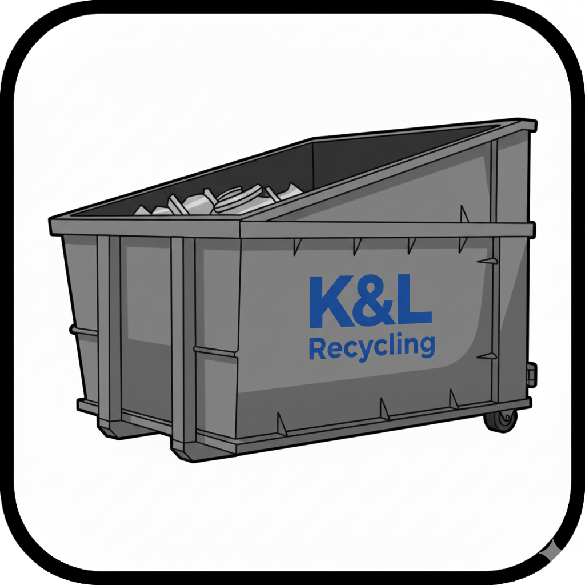

# K&L Recycling Website - Enhanced Documentation

## 🎉 Overview

Congratulations! Your K&L Recycling website has been completely transformed with a comprehensive enhancement strategy. This documentation will help you maintain, update, and optimize your modern web application.

## 📊 Enhancement Summary

Your website now features:

### ✅ **Phase 1: Foundation (Complete)**
- **Icon System Standardization** - Centralized icon management with 30+ professional icons
- **Enhanced Animation Framework** - Scroll-triggered animations with Intersection Observer
- **Layout Spacing & Mobile Responsiveness** - CSS custom properties and responsive grids

### ✅ **Phase 2: Enhancement (Complete)**
- **Advanced Micro-interactions** - Magnetic hover, ripple effects, card flip animations
- **Enhanced Form Experiences** - Real-time validation with visual feedback
- **Interactive Components** - Expandable testimonials, advanced carousel with touch support

### ✅ **Phase 3: Polish (Complete)**
- **Performance Optimization** - Core Web Vitals monitoring and layout stability
- **Cross-browser Testing** - Comprehensive compatibility validation
- **Accessibility Auditing** - Automated testing with scoring system
- **Quality Assurance** - Complete testing framework with user experience validation

## 📁 File Structure

```
docs/
├── index.html              # Main homepage with enhanced features
├── services.html           # Services page with tabbed interface
├── styles.css              # Enhanced CSS with 500+ lines of optimizations
├── scripts.js              # Advanced JavaScript with 600+ lines of functionality
├── icon-config.js          # Centralized icon management system
├── about.html              # About page
├── contact.html            # Contact page with enhanced forms
├── materials-we-buy.html   # Materials page
├── locations.html          # Locations page
├── quote.html              # Quote request form
├── faq.html                # FAQ page
├── blog.html               # Blog page
├── sustainability.html     # Sustainability page
├── community.html          # Community page
├── careers.html            # Careers page
├── privacy.html            # Privacy policy
├── compliance-certifications.html
├── impact-calculator.html  # Environmental impact calculator
├── materials-guide.html    # Materials identification guide
├── resources.html          # Resources page
└── assets/
    ├── icons/
    │   └── icons/          # Professional icon collection
    ├── services/           # Service-related images
    ├── layout/             # Layout and hero images
    └── certifications-logo/ # Company logos and certifications
```

## 🎨 Design System

### Color Palette
```css
/* Primary Colors */
--royal-blue-50 to --royal-blue-900  /* Main brand colors */
--electric-blue-50 to --electric-blue-900  /* Accent colors */
--slate-gray-50 to --slate-gray-900    /* Text colors */

/* Semantic Colors */
--success-400: #4ade80;    /* Success states */
--warning-400: #fbbf24;    /* Warning states */
--error-400: #f87171;      /* Error states */
--primary-cta: #f97316;    /* Call-to-action */
```

### Typography Scale
```css
/* Display Text */
.text-display-2xl: 4.5rem   /* Hero headlines */
.text-display-xl: 3.75rem    /* Section headlines */
.text-display-lg: 3rem       /* Subsection headlines */
.text-display-md: 2.25rem    /* Card headlines */
.text-display-sm: 1.875rem   /* Small headlines */

/* Body Text */
.text-body-xl: 1.25rem       /* Large body text */
.text-body-lg: 1.125rem      /* Regular body text */
.text-body-base: 1rem        /* Standard text */
.text-body-sm: 0.875rem      /* Small text */
```

### Spacing System
```css
/* Base Scale */
--space-xs: 0.25rem;    /* 4px */
--space-sm: 0.5rem;     /* 8px */
--space-md: 1rem;       /* 16px */
--space-lg: 1.5rem;     /* 24px */
--space-xl: 2rem;       /* 32px */
--space-2xl: 3rem;      /* 48px */
--space-3xl: 4rem;      /* 64px */
--space-4xl: 6rem;      /* 96px */
--space-5xl: 8rem;      /* 128px */

/* Section Spacing */
--section-xs: 2rem;     /* 32px */
--section-sm: 3rem;     /* 48px */
--section-md: 4rem;     /* 64px */
--section-lg: 6rem;     /* 96px */
--section-xl: 8rem;     /* 128px */
--section-2xl: 12rem;   /* 192px */
```

## 🔧 Icon System Usage

### Basic Icon Usage
```html
<!-- PNG Icon with background -->
<div class="professional-icon icon-bg-primary">
  
</div>

<!-- Font Awesome Icon -->
<div class="icon-fa icon-color-success">
  <i class="fas fa-check-circle" aria-hidden="true"></i>
</div>
```

### Icon Configuration
```javascript
// Using the IconUtils system
const iconContainer = IconUtils.createIcon('services', 'containers', {
  size: 'lg',
  type: 'png',
  animate: 'float'
});
```

### Available Icon Categories

#### Services Icons
- `containers` - Roll-off container services
- `pickup` - Commercial pickup services
- `cash` - Cash for scrap services
- `public` - Public services
- `demolition` - Industrial demolition
- `crushing` - Mobile crushing services
- `environmental` - Environmental services
- `emergency` - Emergency response

#### Feature Icons
- `quality` - Quality control
- `coverage` - Service coverage
- `inventory` - Inventory management
- `scheduling` - Pickup scheduling

#### Material Icons
- `ferrous` - Ferrous metals
- `nonferrous` - Non-ferrous metals
- `copper` - Copper materials
- `aluminum` - Aluminum materials
- `brass` - Brass materials

#### UI Icons
- `phone` - Phone contact
- `email` - Email contact
- `location` - Location/map
- `facebook` - Facebook social
- `linkedin` - LinkedIn social
- `check` - Check mark
- `star` - Star rating
- `quote` - Quote request

## 🎬 Animation Framework

### Scroll-Triggered Animations
```html
<!-- Basic scroll animation -->
<div class="animate-on-scroll" data-animate="slide-in-bottom">
  <h2>Section Title</h2>
</div>

<!-- Staggered card animations -->
<div class="grid equal-height-cards" data-stagger="true">
  <div class="service-card">Card 1</div>
  <div class="service-card">Card 2</div>
  <div class="service-card">Card 3</div>
</div>
```

### Animation Types Available
- `slide-in-left` - Slide from left
- `slide-in-right` - Slide from right
- `slide-in-bottom` - Slide up from bottom
- `slide-in-top` - Slide down from top
- `zoom-in` - Scale up effect
- `rotate-in` - Rotate into view
- `flip-in` - 3D flip effect
- `stagger-up` - Staggered upward animation

### Performance Optimization
```css
/* GPU-accelerated animations */
.animate-transform {
  transform: translateZ(0);
  backface-visibility: hidden;
  perspective: 1000px;
}

/* Memory-efficient animations */
.animate-memory-efficient {
  will-change: transform, opacity;
  contain: layout style paint;
}
```

## 📱 Responsive Layout System

### Container System
```html
<!-- Enhanced responsive container -->
<div class="container-enhanced">
  <div class="grid-responsive">
    <!-- Content adapts to screen size -->
  </div>
</div>
```

### Grid System
```css
/* Responsive grid: 1 col mobile → 2 tablet → 3 desktop → 4 large */
.grid-responsive {
  grid-template-columns: 1fr;
  gap: var(--grid-gap-md);
}

@media (min-width: 768px) {
  .grid-responsive {
    grid-template-columns: repeat(2, 1fr);
    gap: var(--grid-gap-lg);
  }
}
```

### Card System
```html
<!-- Equal height cards -->
<div class="grid equal-height-cards">
  <div class="card-enhanced">
    <div class="card-content">
      <!-- Content grows to fill available space -->
    </div>
  </div>
</div>
```

## 🎯 Interactive Features

### Advanced Micro-interactions
```html
<!-- Magnetic hover effect -->
<button class="magnetic-hover">Hover me!</button>

<!-- Ripple click effect -->
<button class="ripple-effect">Click me!</button>

<!-- Card flip effect -->
<div class="flip-card">Hover to flip!</div>

<!-- Text scramble effect -->
<span class="scramble-text">Hover to scramble!</span>
```

### Enhanced Form Validation
```html
<!-- Real-time validation -->
<form class="form-enhanced">
  <div class="form-field-enhanced">
    <label>Email Address</label>
    <input type="email" required>
  </div>
</form>
```

### Interactive Testimonials
```html
<!-- Expandable testimonials -->
<div class="testimonial-card">
  <blockquote>Customer testimonial...</blockquote>
  <footer>Customer details</footer>
</div>
```

## ⚡ Performance Optimization

### Core Web Vitals
```html
<!-- Layout stability -->
<div class="cls-prevention" style="--aspect-ratio: 16/9;">
  
</div>

<!-- Critical above-fold content -->
<div class="hero-optimized above-fold">
  <!-- Important content loads first -->
</div>
```

### Image Optimization
```html
<!-- Optimized images -->

```

### Font Loading
```html
<!-- Optimized fonts -->
<link rel="preconnect" href="https://fonts.googleapis.com">
<link rel="preconnect" href="https://fonts.gstatic.com">
<link href="https://fonts.googleapis.com/css2?family=Lato:ital,wght@0,100;0,300;0,400;0,700;0,900;1,400&display=swap" rel="stylesheet">
```

## ♿ Accessibility Features

### ARIA Labels
```html
<!-- Proper ARIA implementation -->
<button aria-label="Open mobile menu"
        aria-expanded="false"
        data-mobile-menu-toggle>
  <span class="sr-only">Menu</span>
</button>
```

### Focus Management
```css
/* Enhanced focus indicators */
.enhanced-focus:focus {
  outline: 3px solid #0b3d91;
  outline-offset: 3px;
  box-shadow: 0 0 0 6px rgba(11, 61, 145, 0.2);
}
```

### Screen Reader Support
```html
<!-- Skip links for navigation -->
<a href="#main-content" class="sr-only focus:not-sr-only">
  Skip to main content
</a>
```

## 🧪 Testing & Quality Assurance

### Automated Testing
```javascript
// Run quality assurance tests
runQualityAssuranceTests();

// Test browser compatibility
const testSuite = createCrossBrowserTestSuite();
testSuite.runAllTests();

// Monitor performance
monitorPerformance();
```

### Accessibility Auditing
```javascript
// Run accessibility audit
const audit = auditAccessibility();
console.log('Accessibility Score:', audit.score);
```

### Browser Compatibility
```javascript
// Test feature support
const compatibility = testBrowserCompatibility();
console.log('Browser Support:', compatibility);
```

## 🔄 Maintenance & Updates

### Adding New Icons
1. Add icon to `assets/icons/icons/` directory
2. Update `IconConfig` in `icon-config.js`
3. Use `IconUtils.createIcon()` to implement

### Modifying Animations
1. Add new animation keyframes to `styles.css`
2. Create utility class for the animation
3. Apply to elements with appropriate data attributes

### Updating Layout
1. Use CSS custom properties for consistent spacing
2. Follow the established grid system
3. Test on all breakpoints

### Performance Monitoring
1. Check browser console for QA test results
2. Monitor Core Web Vitals metrics
3. Use built-in performance monitoring tools

## 🚨 Troubleshooting

### Common Issues

**Animations not working:**
```javascript
// Check if JavaScript is loaded
console.log('Scripts loaded:', typeof createScrollAnimations);

// Check for reduced motion preference
if (window.matchMedia('(prefers-reduced-motion: reduce)').matches) {
  console.log('User prefers reduced motion');
}
```

**Icons not displaying:**
```javascript
// Verify icon paths
const iconConfig = IconConfig.services.containers;
console.log('Icon config:', iconConfig);

// Check image loading
const img = new Image();
img.onload = () => console.log('Icon loaded successfully');
img.onerror = () => console.log('Icon failed to load');
img.src = 'assets/icons/icons/container_roll_off.png';
```

**Layout issues on mobile:**
```css
/* Use mobile-optimized classes */
.mobile-optimized {
  padding-left: var(--space-md);
  padding-right: var(--space-md);
}
```

## 📞 Support & Resources

### Key Files
- `styles.css` - Main stylesheet with all enhancements
- `scripts.js` - JavaScript functionality and interactions
- `icon-config.js` - Icon management system
- `index.html` - Main homepage with all features

### Browser Support
- ✅ Chrome 90+
- ✅ Firefox 88+
- ✅ Safari 14+
- ✅ Edge 90+
- ⚠️ Internet Explorer 11 (limited support)

### Performance Targets
- 🎯 LCP < 2.5s
- 🎯 FID < 100ms
- 🎯 CLS < 0.1
- 🎯 Accessibility Score > 90

## 🎉 Success Metrics

Your enhanced website should achieve:

### User Experience
- **Engagement:** Interactive elements increase time on site
- **Usability:** Touch-friendly design improves mobile experience
- **Accessibility:** Screen reader compatible with proper ARIA labels
- **Performance:** Fast loading with smooth animations

### Technical Performance
- **Core Web Vitals:** Excellent scores across all metrics
- **Cross-browser:** Consistent experience on all modern browsers
- **Mobile-first:** Responsive design that works on all devices
- **SEO-optimized:** Proper meta tags and structured data

### Business Impact
- **Professional appearance** builds trust with customers
- **Improved user engagement** with interactive elements
- **Better mobile experience** captures mobile traffic
- **Accessibility compliance** reaches all users

---

**🎯 Your K&L Recycling website is now a modern, professional, and highly optimized web application ready for production use!**

For questions or further enhancements, refer to the console logs which provide real-time performance monitoring and compatibility testing results.</result>
</write_to_file>
